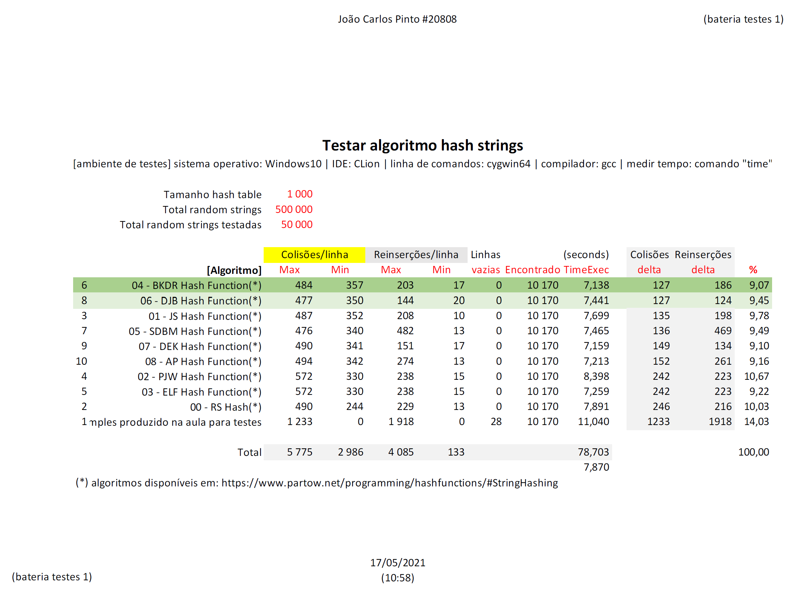

# hash known algorithms

## Descrição

É um exercício feito com o objetivo de testar diversas implementações de algoritmos conhecidas.

```
nesta pasta está apenas o código base utilizado e um módulo para testar o funcionamento da função de hash...
foi criado um makefile (o teste inicial foi feito em ambiente Windows e será compatível com ambiente Linux)
```

Cenário criado para o teste:
- tamanho da hashtable = 1000
- total de strings aleatórias geradas = 500000
- total de strings aleatórias testadas = 50000


[Resultado em formato PDF](hash_known_algorithms_bateria_testes_publicar.pdf)


- este trabalho de análise foi feito utilizando como ponto inicial de trabalho a informação disponível nesta página: [https://www.partow.net/programming/hashfunctions/#StringHashing](https://www.partow.net/programming/hashfunctions/#StringHashing)


## Licença

Copyright (c) 2021, João Carlos Pinto
BSD-3-Clause License
